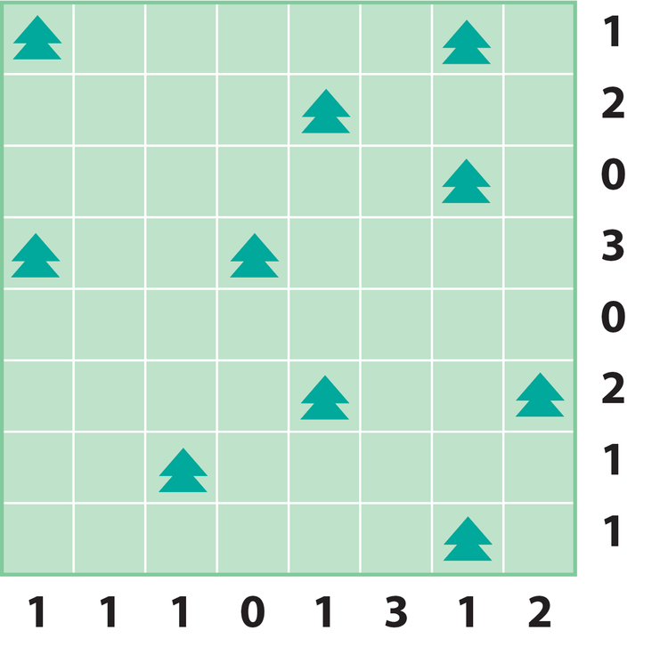
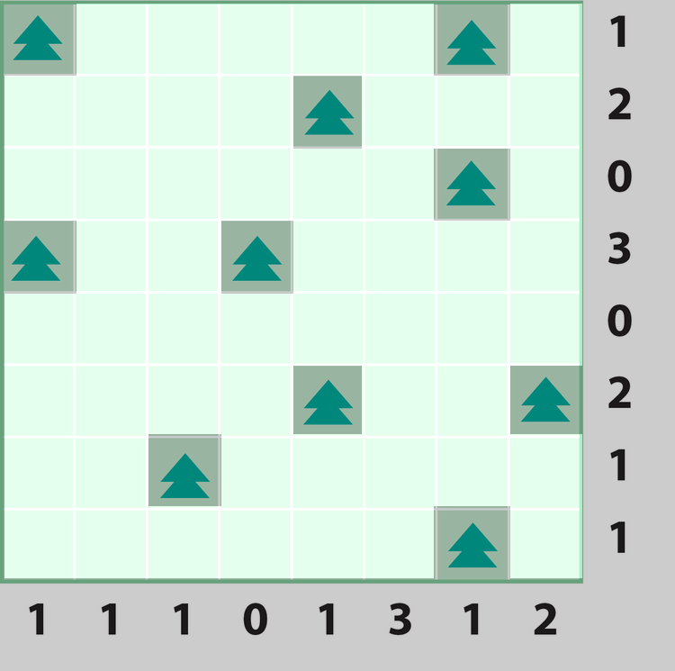
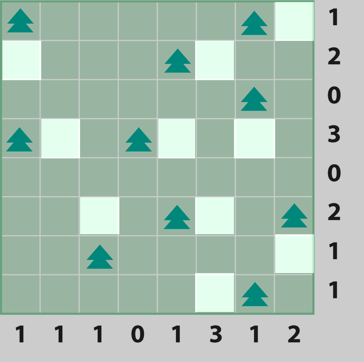
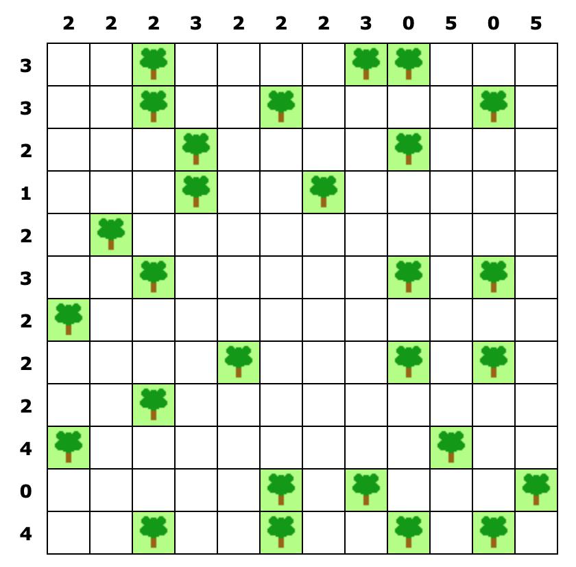
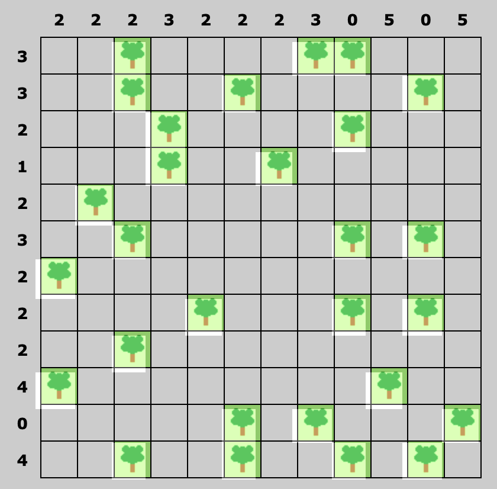
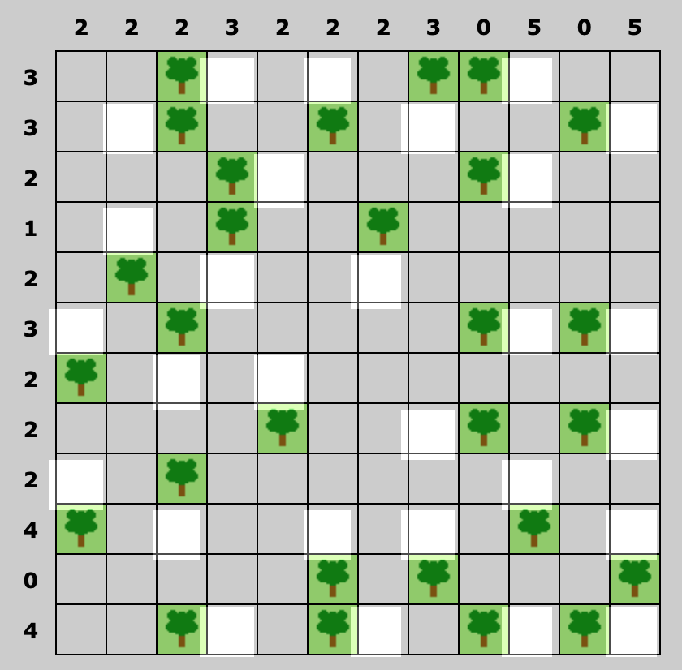

# Tents and Trees.
This repository contains scripts that help solve Tents and Trees with a game image as input. Tents and trees is a puzzle often found in newspapers. To solve the puzzle, tents have to be placed on a campsite by following these rules:

- The numbers outside the grid show how many tents in that row or column.
- Tents can only be planted next to trees (horizontally or vetrically)
- Tents cannot touch each other, not even diagonally.

# Expected Results

This repository contains 2 notebooks, fist, [puzzle_detector](./tree_detector.ipynb) that automatically detects the squares of the puzzle and determines if the square contains a tree using Computer vision and Clustering techniques. The second notebook [tents_and_trees_solver](./tents_and_trees_solver.ipynb), uses linear programming to solve the game with manual input of row and column tree limits and tree locations (obtained by the puzzle detector).

Input Image | Detected Trees | Solution
:-:|:-:|:-:
 |  | 
 |  | 

# Further work

The tree detection algorithm was developed using the first imput image in the examples above. Without any further modification the algorithm was able to automatically detect trees in the second example. However, the detector is able to process only subset of game images that are 1) not rotated and 2) perfectly cropped. It requruires further work to ensure that trees can be detected in all game images.

On the other hand, the tents and trees solver is generalizable and can solve any game, as long as it is provided with correct input. 

The presented code detects trees from a game image, and is able to solve the puzzle with manual input of tree restraints. To automatically solve a tents and trees game from an image, I might someday expand the tree detector with functionality to detect tree restains. 

## Installing dependencies

Install dependencies in a new anaconda environment and activate the environment (tested on Windows):

```
conda env create -f environment.yml
conda activate tents_n_trees
```


